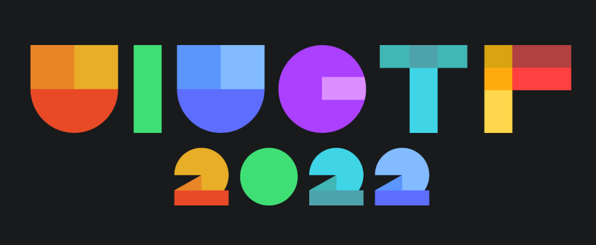

# 🚩 UIUCTF 2022 

## 🧾 Overview
 
<h1 align="center"> </h1> 

> [UIUCTF](https://ctftime.org/ctf/95) is the yearly capture the flag competition run by **SIGPwny (Special interest Group for Computer Security)** from the University of Illinois at Urbana-Champaign

# 📚 Write-ups
 
 | Challenge Name          | Points
 | --------------          | ------
 | [AR Pwny](web/ARPwny/) | 50/50
 | Everyone's A Critic 1 | 50/50
 | Everyone's A Critic 4 | 50/50
 | Everyone's A Critic 6 | 50/50
 | Feedback Survey | 100/100

## 🥇 Competition Results
* **Final Rank:** 91 out of 395 
* **Team Score:** 550 points
* **Contest Rating:** 34.64
* **Event & Scoreboard:** [ctfTime](https://ctftime.org/event/1600) 

## 🙋‍♂️ Organizer
* **Website:** [SIGPwny](https://sigpwny.com)
* **Closing Ceremony:** [YT Stream](https://youtu.be/OYjxHoWDhxE)
