# 🎯 UIUCTF 2022: AR Pwny


## 🧾 Description
 
<h1 align="center"> </h1> 
<blockquote>
Welcome to the meataverse! 

http:// ar-pwny-web . chal . uiuc . tf

_author: ian5v_
</blockquote>

<!-- ## Attached Files

- None
-->

## 🍦 Solution TL;DR

* Grab the **GLB** binary file from the page source & perform basic forensics 
* Convert to **glTF** format and locate the flag segments
* Use a 3D rendering engine debugger to visualize & isolate the flag segments i.e QR codes
* Decode the QR codes & combine them to obtain the flag


## 🔎 Detailed Solution

### **📌 Step 1 : Web Inspection**
Navigating to the challenge  using a regular MS Edge browser, the webpage is basically a fancy [SIGpwny](https://sigpwny.com/) logo in interactive 3D view.

<h1 align="center">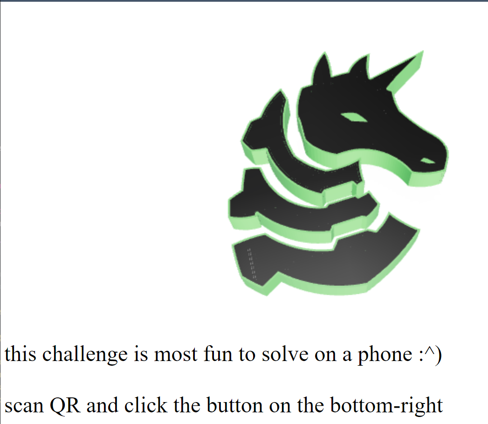 </h1> 

Switch to mobile device? That's interesting!  Open **view source** page with <kbd>CTRL + U</kbd> hotkey.

```html
<!-- redacted section -->
<meta name="twitter:card" content="player" />
<meta name="twitter:title" content="hey there ctf player >:o) why dont u solve my challenge :^)" />
<meta name="twitter:image" content="0" />

<!-- redacted section -->
<meta name="twitter:player:stream" content="https://video.twimg.com/ext_tw_video/1553060639530225664/pu/vid/920x720/qT8hHQq3KZUFi7uo.mp4?tag=12" />

<!-- redacted section -->
<script type="module" src="model-viewer.min.js"></script>

<model-viewer style="width: 100%; height: 80%" src="pwny.glb" ar ar-modes="webxr scene-viewer quick-look" seamless-poster shadow-intensity="1" camera-controls enable-pan></model-viewer>

<!-- redacted section -->
```

Sweet! Looks like there are couple of suspicious signs with useful info:

* A peculiar _pwny.glb_ file detected, which may contain the model data for rendering. A quick web search shows that the **GLB** file format carries binary information about 3D scenes, models, lighting, textures and node hierarchy.
* The 3D model is rendered by [model-viewer](https://modelviewer.dev/), an open source web component by Google for web browsers as well as **"Augmented Reality"** environments.

* Additionally, a fishy video link is lurking in the meta tags. Let's play the [video](https://video.twimg.com/ext_tw_video/1553060639530225664/pu/vid/920x720/qT8hHQq3KZUFi7uo.mp4?tag=12).<h1 align="center">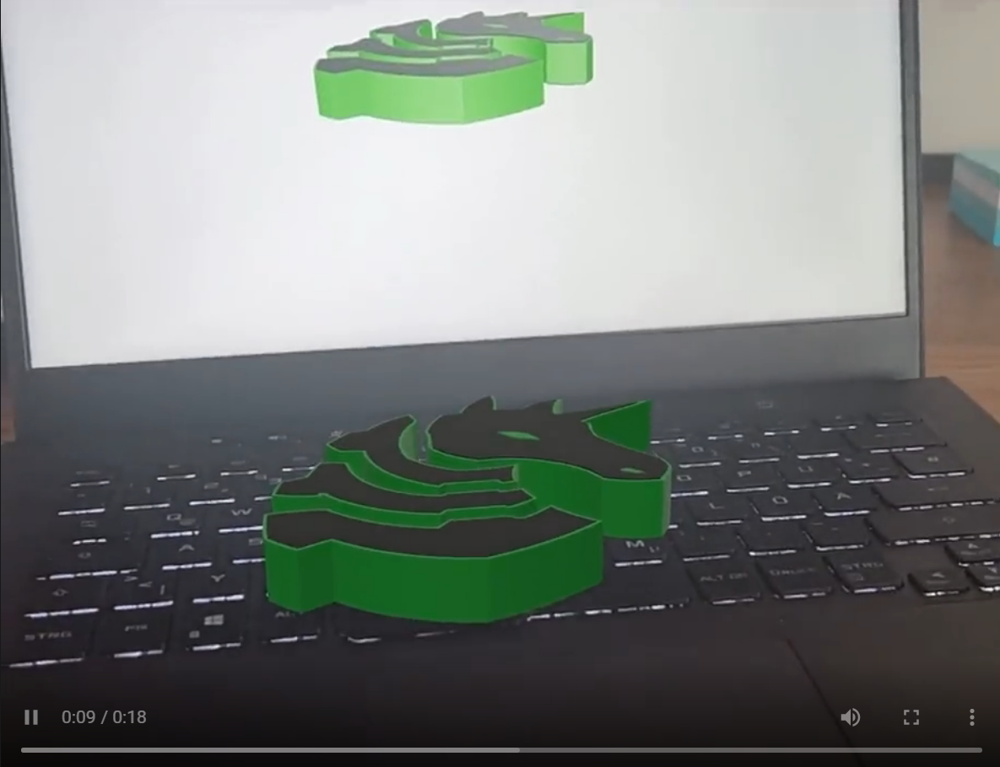 </h1> 
The author must've been using an AR viewer app (challenge title says so as well)! <blockquote> In case you're wondering. an AR viewer app overlays the 3D immersive object on the top of your physical surroundings, which can be visualized through the lens of a smartphone camera.</blockquote> 

### **📌 Step 2 : What's in the Blackbox? 🗃**

Before proceeding into forensics of the **.glb** data, let's follow the challenge instructions first.

- First check whether impersonating a mobile client would do the trick. Open _Edge Devtools_ (<kbd>CTRL+SHIFT+I</kbd>), toggle device emulator and refresh the page. <h1 align="center">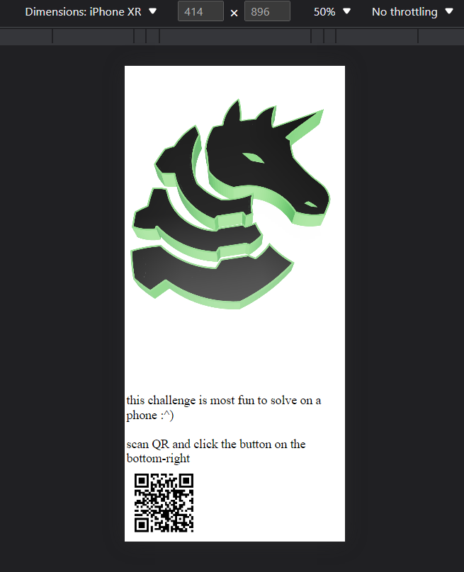 </h1> Sadly, there's no button on the bottom right for interaction as instructed, so this approach won't be useful.

- Let's pick up an actual mobile device. Any recent smartphone model should have AR compatibility out of the box. Installing an AR viewer app (ex: [Augment](https://www.augment.com/)) and scanning the QR code takes us into the AR experience. Suddenly there's giant virtual pwny on my workstation floor! <blockquote> For iOS devices, the minimum requirement for AR compatibility is _iOS 11_ running on _A9 chip_ (that means any device model after _iPhone 5_ could do the job).</blockquote><h1 align="center">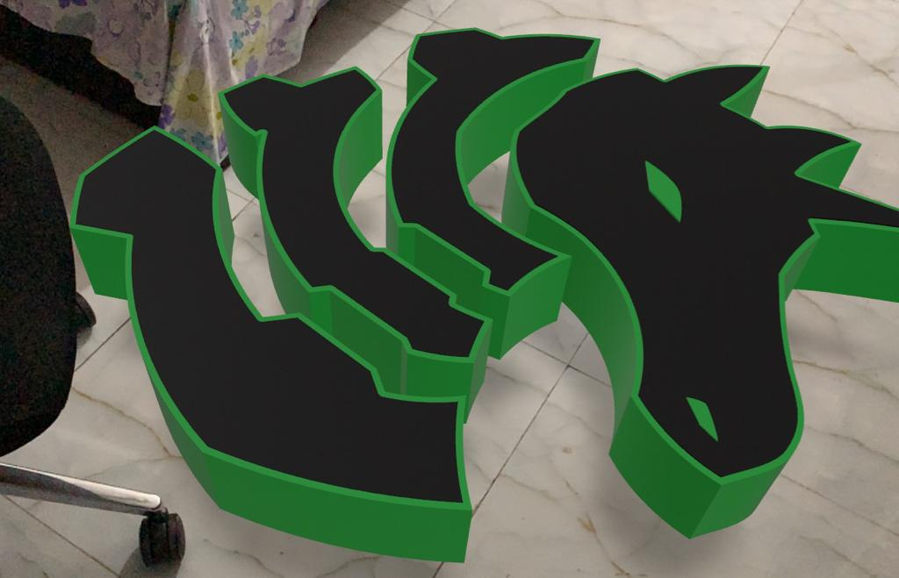</h1> Searching every nook and corner around the surface don't seem to reveal any clue (note that I'm doing the search assuming the object has **solid fill**). Guess it's the time for _plan B - digging up the model data._


### **📌 Step 3 : Whitebox 📦 Forensics** 

Running a quick string check with `strings` tool gives following results:

```console
bijoy@kali:~/Desktop/uiuctf_22/web/pwny$ strings pwny.glb
glTF
JSON{"asset":{"generator":"Khronos glTF Blender I/O v3.2.40","version":"2.0"},"scene":0,"scenes":[{"name":"Scene","nodes":[0,1,2,3,4,5,6,7,8,9,10,11,12]}],"nodes":[{"mesh":0,"name":"flag-firsthalf","rotation":[-0.7071068286895752,-0.7071068286895752,0,3.0908616110991716e-08],"scale":[2.5827651023864746,2.5827651023864746,2.582765579223633],"translation":[2.0828332901000977,-0.5367418527603149,-2.838243007659912]}

# REDACTED REMAINING OUTPUT
``` 
It's clear that the file contains some [JSON](https://www.json.org/json-en.html) data (will come in handy), and a web search reveals that it is generated via a [Blender](www.blender.org) add-on called **glTF Importer and Exporter** from _Khronos Group_. 

Digging up a bit more, this **glTF** (GL Transmission Format) format turns out to be the clue. Basically, it's a stripped down JSON file that references the corresponding mesh, animation, and texture data in internal files for quick transmission needs. In contrast, it's distant cousin, our **GLB** format contains the glTF asset (JSON object, .bin and images) in a binary blob, just like the output suggested.

Opening the file in **Visual Studio Code** editor thankfully invokes a suggestion for **glTF Tools** extension for processing and analysis. (and that's why I always love VS Code ❤)! <h1 align="center">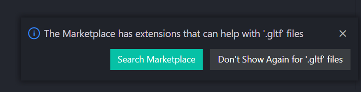 </h1>  <h1 align="center"> </h1>

Using the tool, apply _Import from glb_ operation on the file to convert it to equivalent glTF file (with a .bin file popping up as expected). Let's inspect the JSON structure. What do we have here? 
    <h1 align="center">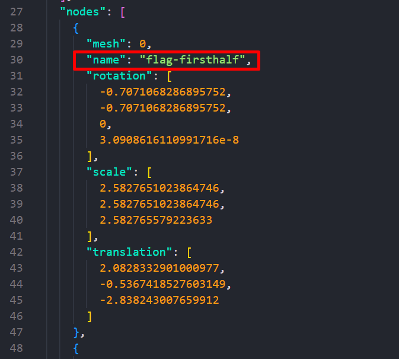 </h1>
    <h1 align="center">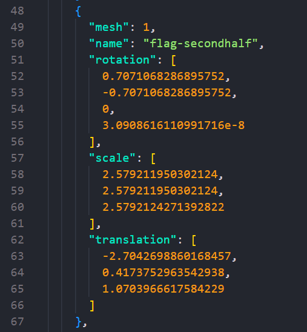 </h1> 
    
Looks like the flag is sliced in two and placed into the model, but the associated data needs to be graphically reconstructed for interpretation. 

### **📌 Step 4 : Lost in Babylon 🕌** 

Peeking through the [extension docs](https://github.com/AnalyticalGraphicsInc/gltf-vscode), the `Preview 3D Model` function should render the model through the common four rendering engines (namely _Babylon.js, Cesium_, _Filament_ and _Three.js_ ).

> Adding a bit of context, **BabylonJS** is a powerful open source GUI system for displaying 3D gaming graphics in a web browser.
<h1 align="center">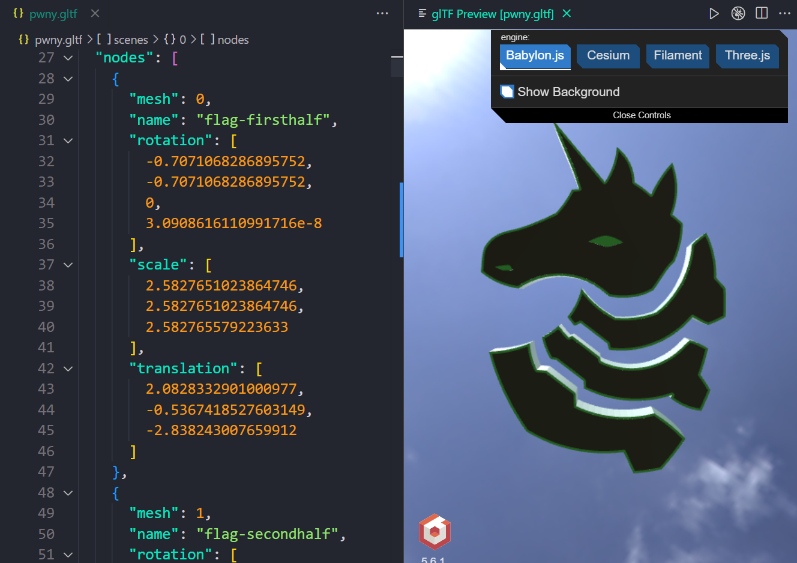 </h1> 

Switching into the glTF **outline view** reveals the tree structure of the scene nodes. 

<h1 align="center">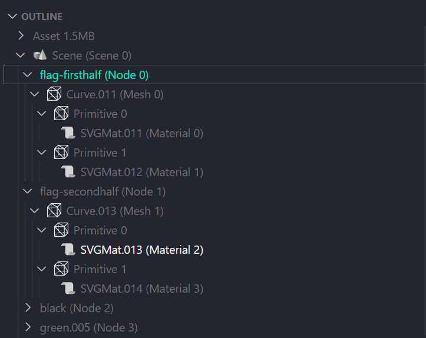 </h1> 

Hierarchically, the data structure is arranged in the following order:

> **scene > node > mesh > primitive > vertices & triangles** 

The structural pattern suggests that rendering only the _flag-firsthalf_ and _flag-secondhalf_ nodes minus the rest of the scene should bring the flag to light.

> BabylonJS comes with a dedicated visual debugging tool called **Inspector** to show model wireframes, normal vectors, texture channels and allows scene exploration. 

Cool! Just the thing we need. Toggle the _Inspector_ icon on top right.

<h1 align="center">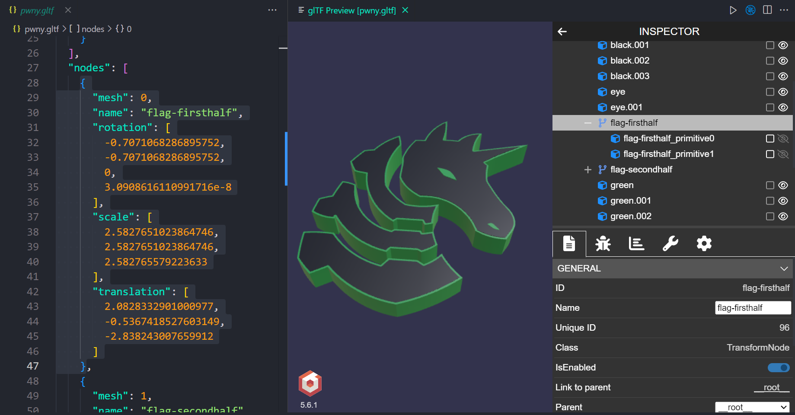 </h1> 

Expand the nodes until flag primitives are visible. Then use the _show/hide_ toggle to remove all the other non-flag nodes one by one and voila!

<h1 align="center">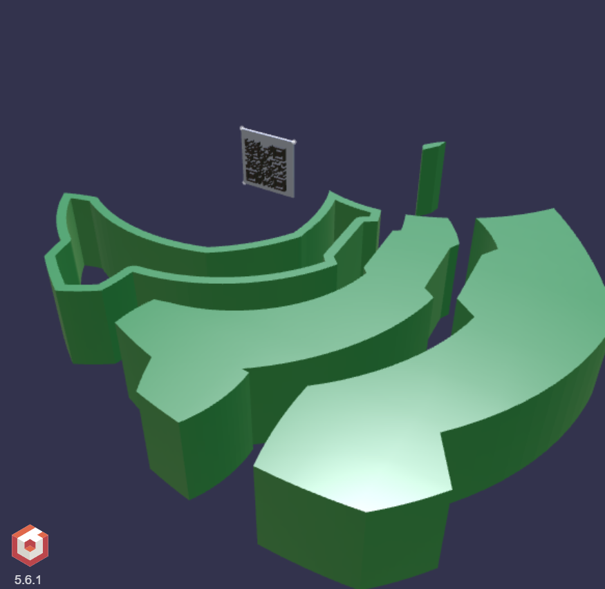 </h1> 

The model was not solid after all, rather a hollow container for the flags! Those QR codes have been hiding inside the object all along!

<h1 align="center">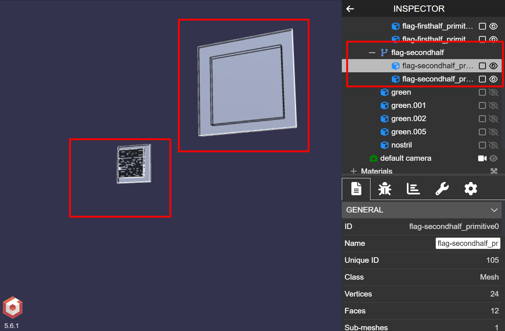 </h1> 

Scan and decode the codes, and the flag slices are obtained. 

Slice 1: `uiuctf{welcome_2_the_meataverse_`

Slice 2: `erm_i_meant_pwnyverse}`

Combining both, the final flag is obtained. ✌

## ⛳ Flag

```
uiuctf{welcome_2_the_meataverse_erm_i_meant_pwnyverse}
```

## 🧲 Alternative Solutions

Since the model was hollow, looking carefully inside the object using an AR app (see **📌 STEP-2**) would have given away the QR codes pretty early (and save a lot of time ⌚)! My teammate solved it this way. 
<h1 align="center">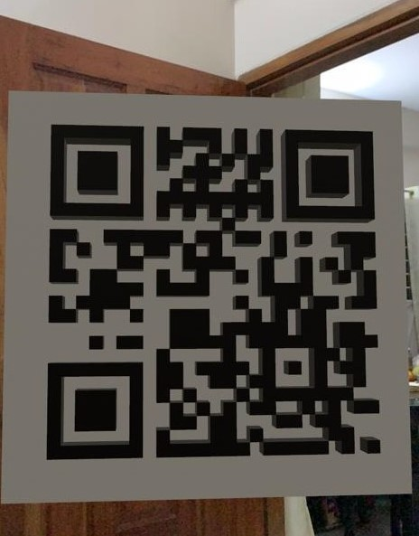 </h1> 

## 🙏 Acknowledgements
Regardless of approach, the challenge is pretty fun to solve. Credit goes to [ian5v](https://twitter.com/ian5v) from SIGpwny.